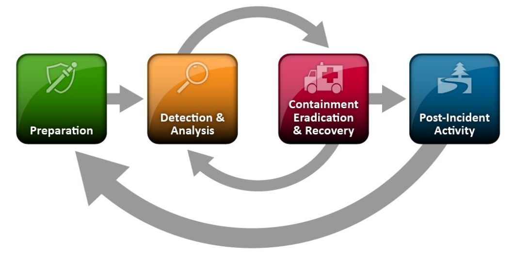

# Incident Response Procedure <!-- omit in toc -->

## Overview <!-- omit in toc -->

This project is a partial incident response procedure for a 100-1000 person company with a small
internal security team having the following prioritized goals:

1. Prevent events from repeating
2. Support quick recovery
3. Enable pursuit of legal action

This is a project for GVSU's Information Security Principles course (CIS 615). See the
[assignment](Assignment.md) for more details.

## Contents <!-- omit in toc -->

- [1. Introduction](#1-introduction)
  - [1.1 Scope](#11-scope)
  - [1.2 Context](#12-context)
- [2. Incident Response Procedures](#2-incident-response-procedures)
  - [2.1 General Procedures](#21-general-procedures)
    - [2.1.1 Preparation](#211-preparation)
    - [2.1.2 Detection & Analysis](#212-detection--analysis)
    - [2.1.3 Containment, Eradication, & Recovery](#213-containment-eradication--recovery)
    - [2.1.4 Post-incident Activity](#214-post-incident-activity)
  - [2.2 Incident Specific Procedures](#22-incident-specific-procedures)
    - [2.2.1 Incident: Distributed Denial Of Service](#221-incident-distributed-denial-of-service)
    - [2.2.2 Incident: Insider Breach](#222-incident-insider-breach)
- [3. Scenario Discussions](#3-scenario-discussions)
  - [3.1 Scenario: Domain Name System (DNS) Server Denial of Service (DoS)](#31-scenario-domain-name-system-dns-server-denial-of-service-dos)
    - [3.1.1 Description](#311-description)
    - [3.1.2 Discussion](#312-discussion)
  - [3.2 Scenario: Unauthorized Access to Payroll Records](#32-scenario-unauthorized-access-to-payroll-records)
    - [3.2.1 Description](#321-description)
    - [3.2.2 Discussion](#322-discussion)
- [License](#license)

# 1. Introduction

## 1.1 Scope

This is a partial incident response plan. NIST provides a comprehensive approach in [SP
800-61](https://nvlpubs.nist.gov/nistpubs/SpecialPublications/NIST.SP.800-61r2.pdf) consisting of
four stages:

1. Preparation
2. Detection & Analysis
3. Containment, Eradication, & Recovery
4. Post-incident Activity

This project establishes basic procedures for each stage as shown in figure 1.

  
*Figure 1: Incident Response Lifecycle ([NIST SP
800-61](https://nvlpubs.nist.gov/nistpubs/SpecialPublications/NIST.SP.800-61r2.pdf) p. 21)*

The document is organized according to general procedures, incident specific procedures for two
incident types, and discussions of two scenarios posed in NIST SP 800-61 Appendix A (p. 52). Stages
1, 2, and 4 are primarily covered under the general procedures. Stage 3 is largely particular to the
incident type, and is covered under incident specific procedures.

## 1.2 Context

This incident response procedure is written in the context of a 100-1000 person company with a small
internal security team having the following prioritized goals:

1. Prevent events from repeating
2. Support quick recovery
3. Enable pursuit of legal action

This company prefers to deal with incidents internally. It is willing to invest in extra hardware in
order to expedite recovery.

# 2. Incident Response Procedures

## 2.1 General Procedures

The following procedures apply to all incident types.

### 2.1.1 Preparation

#### 2.1.1.1 Backup Critical Systems

In order to support quick recovery, backup all critical systems. Critical systems include any that
would cost more than one business day to restore from clean images or incur unacceptable data loss.
Backup period and depth will differ for each system. Backup depth is required to recover from
incidents lasting longer than a single backup period.

#### 2.1.1.2 Stay Up to Date with Patches

In order to prevent events from repeating and prevent events in the first place, stay up to date
with patches. Internet-facing services must apply all security-related patches within 48 hours of
release. Internal systems must apply all security-related patches within 2 weeks of release.

#### 2.1.1.3 Maintain an Issue Tracking System

Track and monitor all issues in a centralized system. Inputs originate from employees, IT, and
security team staff. The security team must reply to, update, and close all security related issues.

#### 2.1.1.4 Store Known Good Images

In order to support quick recovery, create backups of known good OS and application images. Store
images on external media unplugged from any system.

#### 2.1.1.5 Maintain an Inventory of Replacement Hardware

In order to support quick recovery, and because the organization is willing to fund extra hardware
to expedite recovery, maintain an inventory of server, networking, and workstation hardware in an
amount sufficient to rebuild critical infrastructure from scratch to 20% capacity for external
services and 10% capacity for internal services.

#### 2.1.1.6 Install Basic Host and Network Security Tools

Setup basic security tools to monitor and control host and network activity. The exact tools
selected will vary depending on the environment; examples include antivirus software, log analyzers,
network traffic analyzers, and honeypots. These tools support quick recovery and can be used to
prevent future incidents of the same nature from repeating.

#### 2.1.1.7 Establish Centralized Logging

Use centralized logging for the tools setup in 2.1.1.6. Backup the logs as a critical data system
per 2.1.1.1. These centralized logs will be used to establish the sequence of events during an
incident and are required to enable pursuit of legal action. They will also be referenced during
incident investigation and recovery.

#### 2.1.1.8 Gather Contact Information

Identify and gather contact information on paper for the following parties:

- All security team staff
- All C-suite executives
- The organization's ISP
- Critical software vendors (as applicable)
- Affected external parties (as applicable)
- Corporate legal counsel
- US-CERT (if applicable)
- Law enforcement agency contacts:
  - Local police department
  - State police
  - FBI
  - DHS (if applicable)

Contact information may include phone numbers, email addresses, or public encryption keys.
Establishing contact channels before an incident occurs is necessary to support quick recovery and
enable pursuit of legal action.

#### 2.1.1.9 Prepare Dedicated Forensics Workstations

Provision workstations dedicated to forensics activities. The workstations require protections such
that they can (a) perform otherwise dangerous operations and (b) provide detailed logs on the
activities they perform. With an acceptable cost of extra hardware, these workstations support quick
recovery and data collection to enable legal action.

### 2.1.2 Detection & Analysis

#### 2.1.2.1 Monitor Logs for Precursors and Indicators

In order to quickly detect incidents, continuously monitor activities reported by the tools setup in
2.1.1.6 and recording to the logs in 2.1.1.7. Have a security team member monitor directly during
normal business hours; have one employee on call at all times and tools configured to push notices
to that employee's mobile device.

#### 2.1.2.2 Document Incidents Immediately

In order to establish a paper trail of observed activities and the security team's response,
document all security events immediately. All observations, notes, and actions must be logged.
During periods of high activity, have one team member performing actions and the other dedicated to
logging.

#### 2.1.2.3 Triage Incidents for Prioritized Response

Establish rules to prioritize responses. Heuristics may include:

- Ability to remediate
- Ability to prevent from repeating
- Time required to respond
- Material cost required to respond
- Reputation damage caused by the incident
- Legal obligations
- Ability to pursue legal action

### 2.1.3 Containment, Eradication, & Recovery

#### 2.1.3.1 Document All Response Steps

As in 2.1.2.2, continue to document all observations, notes, and actions taken during containment,
eradication, and recovery. Use the dedicated forensics workstations from 2.1.1.9 for applicable
activities.

#### 2.1.3.2 Understand the Issue

Understand the nature of the issue before eradication. Some issues require immediate action (e.g., a
rapidly spreading worm). Some issues require care before an eradication can be successful (e.g., an
APT that is well-established in the network). Make sure that containment steps will not exacerbate
the problem.

#### 2.1.3.3 Deploy Backup Hardware

If the incident is causing system unavailability, while the incident is still under investigation
but after it has been deemed safe to do so, deploy the backup hardware from 2.1.1.5 to replace the
affected systems. Setup the backup hardware with the stored images from 2.1.1.4 and data backups
from 2.1.1.1. This enables the fastest possible recovery from the issue.

#### 2.1.3.4 Respond

Perform the incident-specific procedures established in 2.2.

### 2.1.4 Post-incident Activity

#### 2.1.4.1 Inform Stakeholders

Contact the relevant parties through the communication channels established in 2.1.1.8. Fulfill all
legal reporting obligations. Contact all internal parties first, elevated to the appropriate level.
Depending on the circumstances of the incident, reach out to the ISP, software vendors, legal, and
law enforcement agencies.

#### 2.1.4.2 Retain Incident Data

Collect an dedicated store of data relevant to the incident. Retain this data while any of the
following are true:

- Legal requirements demand it
- There is an ongoing legal case
- It is within the statue of limitations to prosecute the event
- The data can contribute to lessons learned
- It is less than three years old

#### 2.1.4.3 Involve Law Enforcement if Appropriate

As soon as the possibility of a legal case is established, contact the law enforcement agency with
appropriate jurisdiction and provide them full access to incident data (excepting anonymization to
protect the privacy of innocent parties). The FBI will be the most helpful, as they have cyber
capabilities and most online security incidents cross state borders. Hand off action to the legal
team, supporting them technically as required.

#### 2.1.4.4 Record Lessons Learned

After the incident has been fully resolved, hold a lessons learned meeting. Analyze each stage of
preparation; detection and analysis; containment, eradication, and recovery; and post-incident
activity to determine what went well and what did not. To prevent incidents from recurring,
implement new preparation steps that will acceptably reduce the risk of the event from repeating.
Long term solutions include but are not limited to:

- Remediation: eliminate the risk
- Mitigation: reduce the risk
- Transfer: externalize the cost of the risk
- Accept: actively decide that the risk worth taking
- Avoid: stop engaging in the risky activity

Update the incident response procedure to handle the incident better next time.

## 2.2 Incident Specific Procedures

The following procedures apply only to particular incidents.

### 2.2.1 Incident: Distributed Denial Of Service

A distributed denial of service (DDOS) attack pits a large number of attacker-controlled hosts
against the organization's internet-facing services. The malicious hosts try to consume all of the
server's resources in order to prevent legitimate requests from being handled.

#### 2.2.1.1 Configure Web Servers to Stop Floods

Configure the attacked servers to protect against HTTP and SYN floods. Specific procedures depend on
the web server in use. Block the offending IP address and attempt to increase bandwidth above what
the attacker can consume.

#### 2.2.1.2 Coordinate with ISP to Block IPs

Contact the ISP through the communication channel established in 2.1.1.8. Inform them of the attack
and coordinate to block the offending IP addresses before they reach the web server.

#### 2.2.1.3 Post-incident Procedures

Follow the steps in 2.1.4. Specific actions to take following a DDOS attack include the following:

- If the attacking party or botnet has been taken down, unblock the offending IP addresses after
    the attack has ended.
- Reassess appropriate baseline bandwidth and resource allocation for internet services.
- If critical services were interrupted for a significant time, inform customers of the incident and
    steps taken in response.

### 2.2.2 Incident: Insider Breach

An insider breach involves a member of the organization abusing their access rights to violate the
confidentiality, integrity, or availability of a system. Usually the focus is on confidentiality of
user data or organizational intellectual property.

#### 2.2.2.1 Identify and Disable Compromised Accounts

Upon discovery of an insider breach, immediately begin gathering all the accounts associated with
that user and inspect the centralized logs to determine the activities the user has engaged in. Per
2.1.3.2, the user's activity may cause immediate action to be dangerous. In severe cases, the
employee may have to be physically escorted from the building before accounts are disabled in order
to prevent unpredictable behavior. As soon as safely possible, disable all accounts associated with
the compromised user.

#### 2.2.2.2 Restore Data to Good State

Using backups and logs of activity, restore any modified data to a known good state. Though
confidentiality cannot be truly remediated, take down exposed confidential data as possible.

#### 2.2.2.3 Post-incident Procedures

Follow the steps in 2.1.4. Specific actions to take following an insider breach include the
following:

- Discipline the compromised employee. If the employee is not fired, severely restrict their network
    access and responsibilities.
- Audit the account revocation process. Was IT technically able to disable the employee's accounts
    sufficiently quickly?
- Audit hiring practices. Consider background checks for employees with access to sensitive data.

# 3. Scenario Discussions

The following are not procedures, but discussions based on hypothetical situations designed to
demonstrate the above procedures in action.

## 3.1 Scenario: Domain Name System (DNS) Server Denial of Service (DoS)

### 3.1.1 Description

Scenario description ([NIST SP
800-61](https://nvlpubs.nist.gov/nistpubs/SpecialPublications/NIST.SP.800-61r2.pdf) p. 53):

> On a Saturday afternoon, external users start having problems accessing the organization's public
websites. Over the next hour, the problem worsens to the point where nearly every access attempt
fails. Meanwhile, a member of the organization's networking staff responds to alerts from an
Internet border router and determines that the organization’s Internet bandwidth is being consumed
by an unusually large volume of User Datagram Protocol (UDP) packets to and from both the
organization's public DNS servers. Analysis of the traffic shows that the DNS servers are receiving
high volumes of requests from a single external IP address. Also, all the DNS requests from that
address come from the same source port.

### 3.1.2 Discussion

This scenario is closely related to the procedure for DDOS attacks in 2.2.1. Via the tools setup in
2.1.1.6 and monitoring mandated in 2.1.2.1, a security team employee will be notified of this
incident in a timely manner. With the contact information available from 2.1.1.9, the responder will
be able to quickly coordinate with other members of the team and the ISP.

The response procedure would be as follows:

1. The responder documents the presence of the event and all proceeding steps taken.
2. The responder determines that since nearly all legitimate traffic is being blocked, the event is
    severe enough to merit immediate action.
3. Deployment of backup hardware and use of forensic equipment is not applicable in this case
4. The responder first contacts the necessary security and IT staff needed to technically
    remediate the issue, and second contacts executives at the appropriate level to alert them of
    the business impact.
5. The assembled incident response team follows the steps in 2.2.1.1 to configure the DNS server to
    stop floods a handle more traffic. Because it is coming from a single IP address, that address
    is blocked.
6. The incident response team contacts the organization's ISP to block the IP address. Because the
    bandwidth is being consumed with UDP traffic, ignoring the traffic at the server will not
    the problem alone.
7. With the incident technically remediated, the incident response team informs stakeholders of the
    issue and the steps taken in response. If the addresses being resolved by the DNS server were
    for critical services, this may include customers that were affected.
8. All log data and recorded activities are packaged and stored.
9. If the service outage caused considerable financial or safety loss, legal action is initiated.
    Since the attacker used a single IP address to attack from, there is a good chance they can be
    identified.
10. The server is reconfigured for an appropriate bandwidth support.
11. The incident response team holds a lessons learned meeting per 2.1.4.4.

Overall, because the technical solution is relatively simple, only a few security and IT team
members need be involved in incident response. This type of event is not particularly concerning.
The only complicating factor is if the service is critical to financial performance, safety, or
reputation. If that is the case, it should be able to withstand a DOS attack from a single host, and
technical remediations to ensure this cannot happen again are required.

## 3.2 Scenario: Unauthorized Access to Payroll Records

### 3.2.1 Description

Scenario description ([NIST SP
800-61](https://nvlpubs.nist.gov/nistpubs/SpecialPublications/NIST.SP.800-61r2.pdf) p. 55):

> On a Wednesday evening, the organization's physical security team receives a call from a payroll
administrator who saw an unknown person leave her office, run down the hallway, and exit the
building. The administrator had left her workstation unlocked and unattended for only a few minutes.
The payroll program is still logged in and on the main menu, as it was when she left it, but the
administrator notices that the mouse appears to have been moved. The incident response team has been
asked to acquire evidence related to the incident and to determine what actions were performed.

### 3.2.2 Discussion

# License

This project is licensed under the Creative Commons Attribution 4.0 International license. The text
is copyrighted by Kevin Kredit, but is reusable provided credit and license notice. See the license
[text](LICENSE) for more details.
