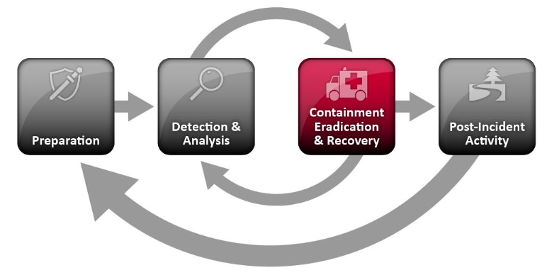

# Incident Response Procedure <!-- omit in toc -->

## Overview <!-- omit in toc -->

This project is a partial incident response procedure for a 100-1000 person company with a small
internal security team with the following prioritized goals:

1. Prevent events from repeating
2. Recovery should be fast
3. Enable data collection to pursue legal action

This is a project for GVSU's Information Security Principles course (CIS 615). See the
[assignment](Assignment.md) for more details.

## Contents <!-- omit in toc -->

- [1. Introduction](#1-introduction)
  - [1.1 Scope](#11-scope)
  - [1.2 Context](#12-context)
- [2. Incident Response Procedures](#2-incident-response-procedures)
  - [2.1 General Procedures](#21-general-procedures)
  - [2.2 Incident Specific Procedures](#22-incident-specific-procedures)
    - [2.2.1 Incident A: Foo](#221-incident-a-foo)
    - [2.2.2 Incident B: Bar](#222-incident-b-bar)
- [3. Scenario Discussions](#3-scenario-discussions)
  - [3.1 Scenario A: Foo](#31-scenario-a-foo)
  - [3.2 Scenario B: Bar](#32-scenario-b-bar)
- [License](#license)

# 1. Introduction

## 1.1 Scope

This is a partial incident response plan. NIST provides a comprehensive approach in [SP
800-61](https://nvlpubs.nist.gov/nistpubs/SpecialPublications/NIST.SP.800-61r2.pdf) consisting of
four stages:

1. Preparation
2. Detection & Analysis
3. Containment, Eradication, & Recovery
4. Post-incident Activity

This project is primarily focused on the "Containment, Eradication, & Recovery" stage as shown in
figure 1. This project contains general procedures and incident specific procedures for two incident
types. Lastly, it discusses two scenarios posed in NIST SP 800-61 Appendix A (p. 52).

*Figure 1: Incident Response Lifecycle ([NIST SP
800-61](https://nvlpubs.nist.gov/nistpubs/SpecialPublications/NIST.SP.800-61r2.pdf) p. 35)*

## 1.2 Context

Procedures in the "Containment, Eradication, & Recovery" stage depend on procedures specified for
each other stage. To place these procedures in context, assume the following for each other stage:

1. Preparation
   - Internal and external contact information is gathered
   - A centralized logging service is established
   - Backups for critical systems are updated monthly and stored for one year
   - An issue tracking system is established
   - Dedicated forensics workstations are prepared
   - Bootable images and clean application installation files are available on removable media
2. Detection & Analysis
   - The organization has some capacity to monitor logs and detect precursors and indicators
   - Incidents are documented immediately (more below)
   - Incidents are triaged according to functional impact, integrity impact, and recoverability
        (more below)
3. Containment, Eradication, & Recovery
   - Covered in this document
4. Post-incident Activity
   - asdf

# 2. Incident Response Procedures

## 2.1 General Procedures

## 2.2 Incident Specific Procedures

### 2.2.1 Incident A: Foo

### 2.2.2 Incident B: Bar

# 3. Scenario Discussions

## 3.1 Scenario A: Foo

## 3.2 Scenario B: Bar

# License

This project is licensed under the Creative Commons Attribution 4.0 International license. The text
is copyrighted by Kevin Kredit, but is reusable provided credit and license notice. See the license
[text](LICENSE) for more details.
